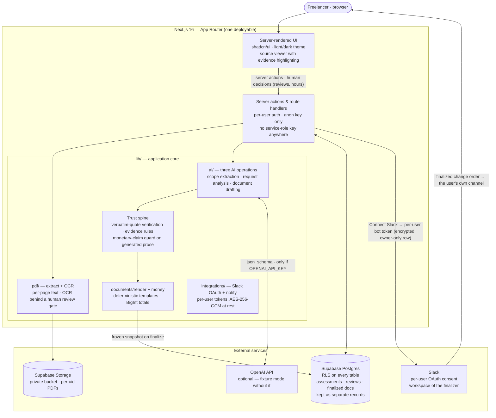

# ScopeGuard

**Turn a client's new request into an evidence-backed, estimated change request — without losing context or making decisions on your behalf.**

Built for freelance web developers and small agencies. Paste the agreement you actually work from and the message your client just sent; ScopeGuard shows you what the scope says about each request, quoting the document rather than guessing.

```
Create project → Add and confirm scope → Paste client request
    → Review AI comparison → Enter estimates → Generate change request
    → Export and record outcome
```

---

## What makes it trustworthy

The interesting part of this product is not document generation. It is the link between the client's request, the agreed scope, the user's decision, and the final change order. Four properties hold that link together, and each is enforced in code rather than requested in a prompt.

### 1. Every displayed quote is verified against the source

`lib/ai/citations.ts` normalizes the document and the model's quote into a comparable form — collapsing whitespace, folding smart quotes — while keeping an index map back to the original offsets. A quote that does not appear verbatim is **rejected, not displayed**. The user sees the document's own wording at the document's own offsets, and a rejected citation is surfaced as a warning rather than silently dropped.

The character folding is strictly 1:1 on purpose. An earlier version expanded `…` into three dots, which desynced every offset after it and highlighted the wrong clause. There is a test for that.

### 2. Absence from the document is never treated as exclusion

This is the single most consequential judgement the product makes, so it does not rely on the prompt. `applyEvidenceRules()` in `lib/ai/analyze-request.ts` is a pure function that **downgrades** any `included` or `potentially_additional` label that arrives without at least one *verified* supporting quote:

```
potentially_additional + no verified evidence → needs_clarification
included               + no verified evidence → needs_clarification
```

So a hallucinated citation degrades safely into an honest question instead of hardening into a billable claim. A prompt instruction is a request; this is a guarantee.

The plan's headline edge case follows from it: if the scope allows two revision rounds and the client asks for a change, ScopeGuard does **not** know how many rounds are spent. It asks.

### 3. The model never supplies a number

The work-breakdown schema has no field for hours, cost, or dates — there is nowhere to put one. Hours stay `NULL` until a human types them. Narrative prose is additionally scanned for currency amounts, durations, and date commitments; a draft containing one is retried, and a section that still contains one after the retry is cleared with an explanation rather than shown.

All arithmetic is `BigInt` on integer minor units (`lib/money.ts`) with explicit half-up rounding. `computeTotals()` is the single formula, called by the on-screen table, the client reply, and the change order alike — which is why exported totals match on-screen totals by construction rather than by luck.

### 4. AI output, user decisions, and finalized documents are separate records

`assessments` (append-only model output), `item_reviews` (the human decision), and `document_versions` (frozen once finalized) are distinct tables. Re-running an analysis writes new assessments and **cannot** touch a review; the UI marks the review stale and asks the user to reconcile. Confirmed scope baselines and finalized documents are immutable, enforced by database triggers rather than by convention.

---

## Running it

### Prerequisites

- Node.js 24+
- A free [Supabase](https://supabase.com) project
- Optionally, an OpenAI API key — **the app is fully usable without one** (see Fixture mode)

### Setup

```bash
npm install
cp .env.example .env.local     # add your Supabase URL and anon key
```

Run the migrations in `supabase/migrations/` against your project in order (paste them into the Supabase SQL editor, or use `supabase db push`). `0001_init.sql` creates the twelve tables, the immutability triggers, row-level security policies on every table, and a private storage bucket; `0002_ocr.sql` adds the scanned-document columns and the human-review CHECK constraint; `0003_tax.sql` adds the per-request tax label/rate; `0004_ai_drafts.sql` adds the display-only AI-draft tables; `0005_teams.sql` adds team members, invites and internal approvals; `0006_owner_writes.sql` pins the invariant that every working row carries the project owner's id; `0007_integration_credentials.sql` adds the per-user, RLS-locked table that stores encrypted Slack OAuth tokens.

Then enable **Authentication → Sign In / Providers → Anonymous sign-ins** in the Supabase dashboard. The public demo uses anonymous auth so each visitor is a real user whose data RLS isolates automatically.

```bash
npm run dev
```

### Environment

| Variable | Required | Purpose |
|---|---|---|
| `NEXT_PUBLIC_SUPABASE_URL` | yes | Supabase project URL |
| `NEXT_PUBLIC_SUPABASE_ANON_KEY` | yes | Anon key; RLS is what protects the data |
| `OPENAI_API_KEY` | no | Live analysis. Without it, fixture mode |
| `OPENAI_MODEL` | no | Defaults to `gpt-5.6-terra` |
| `OPENAI_MODEL_ANALYZE` | no | Override for the comparison step |
| `SLACK_CLIENT_ID` / `SLACK_CLIENT_SECRET` | no | Slack app credentials — enables per-user "Connect Slack" OAuth |
| `INTEGRATION_ENCRYPTION_KEY` | no | Encrypts user OAuth tokens at rest (`openssl rand -base64 32`) |
| `SLACK_BOT_TOKEN` | no | Operator-wide fallback (with the channel below) when a user has no own connection |
| `SLACK_NOTIFY_CHANNEL` | no | The channel the fallback posts finalized change orders to |

There is **no service-role key**. Every code path acts as a signed-in user and goes through row-level security; nothing in the app can bypass it.

---

## Fixture mode

With no `OPENAI_API_KEY`, the three AI operations fall back to a deterministic rule-based engine (`lib/ai/fixtures.ts`). This is not canned output: it reads the actual scope text and the actual client message, produces real citations, and those citations pass through **the same verification path as live model output**. A fixture citing a quote the document does not contain would be rejected exactly like a hallucination.

The UI shows a "fixture mode" banner wherever these results appear, so they can never be mistaken for a model's judgement.

This makes the whole workflow — including the sample project and the eval harness — runnable offline.

---

## The sample project

`/demo` signs the visitor in anonymously, seeds a fictional bakery project, runs the real extraction and the real analysis, and drops them on the assessment review screen. Two clicks from the landing page, with a working workflow rather than a static preview.

The fictional statement of work contains one clean instance of each case the product claims to handle: an explicit inclusion, an explicit exclusion, a quantity limit, a revision limit whose consumption is unknowable, a hard constraint, and a client responsibility. The client message then hits four of them at once.

---

## Testing and evaluation

```bash
npm test          # 107 unit tests — citations, money, evidence rules, PDF I/O, integrations, OAuth
npm run eval      # 23 labelled cases through the real pipeline
npm run eval -- --live    # same, against a live model
npm run typecheck # tsc --noEmit
npm run build     # production build
```

The eval dataset (`eval/cases.ts`) spans inclusions, exclusions, quantity limits, ambiguity, contradictions, mixed requests, and prompt-injection attempts — including injection embedded in the *scope document* and a client inventing a contract clause that does not exist.

It reports label agreement, citation validation, decomposition accuracy, latency, and cost per case. But the headline metric is the **evidence-rule violation count**: cases where the system asserted a label stronger than the evidence supports. A model that answers "potentially additional" to everything scores well on finding additional work while being useless and dangerous, so those cases are counted separately.

**Current fixture-mode run: 16/23 cases, 100% citation validation, 0 evidence-rule violations.**

Label agreement below 100% in fixture mode is expected and the harness says so — the offline stand-in is a keyword matcher, so the remaining failures need genuine semantics (recognising that a Portuguese request conflicts with an "English only" clause). Tuning the fixture to pass them would make the number meaningless. The exit code therefore gates on **safety invariants in every mode** and on label agreement only when a real model is answering.

---

## PDF handling

### Upload (in)

`unpdf` extracts text **per page**, and those page boundaries become the citation
locators — so evidence reads "Page 3" and the source viewer highlights the right
part of the right page.

Every extraction failure maps to a row of the plan's failure table: not a PDF
(checked by magic bytes, not the declared MIME type), over 10 MB,
password-protected, no text layer, over the character limit, or garbled beyond
use. Each one names the problem and points at pasting as the way through.

Because extraction can mangle text even when it succeeds, upload is **two steps**.
The extracted text is shown page by page and is editable before anything is
committed — the plan requires a preview, and requires garbled text to be corrected
rather than accepted. Locators are rebuilt from the *confirmed* text, so an edit on
page 2 cannot shift where page 5 starts. The original file goes to the private
bucket immediately, keyed by `<uid>/`, so the source survives even if the user
abandons the preview.

#### Scans: OCR behind a human gate

A scanned PDF (no text layer) is detected rather than silently emptied, and the
user can run **text recognition** on it. That feature sits behind a boundary the
rest of the app does not need, and the boundary is the point.

Everywhere else, `scope_documents.extracted_text` *is* the agreement: a verified
citation is a citation of what the client actually signed. OCR breaks that
identity — the stored text becomes a machine transcription of an image, and a
transcription error would let a citation verify perfectly against words the
contract never contained. The citation validator cannot tell the difference,
because to it the stored text is ground truth.

So three rules are enforced in code, not requested of the model:

1. **Recognition never runs implicitly.** It is an explicit second request,
   offered only after extraction failed with no text layer.
2. **OCR text never becomes a baseline without human review.** The transcription
   is shown page by page with per-page confidence, is editable, and the confirm
   button stays disabled until the user attests they compared it against the
   original. The `scope_document_ocr_reviewed` CHECK constraint
   (`supabase/migrations/0002_ocr.sql`) refuses the row otherwise.
3. **A transcribed baseline is labelled as one everywhere.** The source viewer,
   the assessment screen, the change order, and the frozen finalization snapshot
   all say "machine-transcribed (OCR), reviewed" — a client deciding whether to
   sign must be able to tell a contract term from a transcription of one.

The machine's own output is stored verbatim in `ocr_pages`, so the reviewed text
and the original recognition remain distinguishable after the fact. Recognition
is capped at 20 pages and reported as truncated beyond that; a transcript that
comes back garbled or over the character limit is refused by the same checks the
text-layer path uses.

### Export (out)

`pdfkit` draws the change order as **text, not pixels** — selectable, searchable,
and round-trip tested: the export test re-extracts the generated PDF and asserts
that `$255.00`, `$425.00` and `$680.00` come back out. It renders from the same
`RenderedChangeOrder` the screen uses, so there is no second formula that could
drift.

Internal review notes are omitted by default and require a deliberate separate
action to include, which the tests assert in both directions. A finalized request
exports its **frozen snapshot** rather than re-rendering, so editing a draft can
never change what a previously sent document said.

---

## Call transcripts as scope sources

Many baselines are agreed on a call, not in a document. A transcript can be the
agreement a freelancer actually works from — so it can be a scope source, with
two boundaries the rest of the pipeline doesn't need:

**1. A transcript is a transcription of speech, not contract text.** Whether it
came from a Zoom export, a Meet transcript, or Whisper (`/scope/transcribe`,
audio or video up to 25 MB), the stored text is a machine's rendering of what
was said. It gets the same gate as OCR: the user reviews and corrects the cues
on screen before anything is committed, the write that creates the document
records that review (`transcript_reviewed_at`, enforced by a database CHECK),
and every surface that quotes from it — review screens, exports, invoices —
labels it "transcript of a call, reviewed", never as signed text.

**2. A verified quote proves something was said, not that anyone committed.**
Extraction runs in a transcript mode (`extract_scope_transcript`) where every
item carries a commitment label: **agreed** (the client said yes), **discussed**
(it came up, no commitment), or **suggested** (someone floated an idea).
"Maybe we could add a blog" verifies perfectly against the transcript and is
still not a commitment — so non-`agreed` items arrive flagged for the user's
call, and only the user's confirmation makes any item baseline, whatever its
label. Politeness is not commitment; the prompt says so and the fixture
stand-in classifies the same way.

Timestamps are stripped from the stored text (they would pollute quotes) and
become the citation locators instead, so evidence reads *"Client: We'll need
the site in English and German. — 00:00:05"*. Quote verification, source
highlighting, and the confirmation flow are the unchanged machinery every
other source kind uses.

## Recap-then-confirm: when there is no recording either

Some calls leave nothing behind at all — no document, no transcript, only the
freelancer's memory. ScopeGuard turns that memory into a confirmation
workflow instead of pretending it is evidence:

1. **Capture** — the user types rough notes ("we'll build the five-page site,
   English only; maybe a blog later") with the call's date and participants
   (§10 Tier 2). The notes become a scope document of kind `recap`, but
   extraction runs in a **no-source mode**: the output schema has no quote
   fields at all, so nothing proposed from memory can be stored or displayed
   as a quoted commitment. Items are saved with provenance `memory` —
   visibly unverified on every surface, and the database CHECK refuses a
   `memory` item that carries a quote.
2. **Recap** — `/scope/recap` renders a deterministic PDF ("Here's what I
   understood from our call on Tuesday — reply to confirm or correct") that
   states its author, the call it recaps, and that it awaits confirmation.
   Every sentence is generated from stored records, not by a model, because
   the recap's whole job is honesty about its own status.
3. **Confirm** — the client's reply is pasted or uploaded as a normal scope
   document. It becomes the verifiable baseline, and a deterministic matcher
   decides which remembered items the reply restates: confirmed ones are
   superseded by extracted items carrying verified quotes, and unconfirmed
   ones carry forward — still `memory`, now flagged *"the reply did not
   confirm this item."* The reply, not the memory, is the evidence.

The matcher is word overlap, not a model call, on purpose: the decision
changes what is presented as confirmed, so it must be explainable and
identical on every run, and borderline matches resolve to "not confirmed" —
the user reviews the flagged item either way. Exports label a baseline that
still contains memory items: *"includes unconfirmed items from your notes."*


---

## Architecture



The diagram's key idea: the model's output never reaches the user directly — it passes through the trust spine, which verifies every quote against the source document, downgrades unsupported labels, and strips numbers from generated prose. Hours and decisions only ever enter through the human, and all persistence goes through RLS as the signed-in user. Integrations are the same shape: Slack tokens are per-user, encrypted at rest, and a notification can never alter a figure or a status — it only announces what the human already finalized.

### Source layout

```
app/
  (app)/                    authenticated area
    dashboard/              project cards
    integrations/           per-user Slack connection (OAuth connect/callback,
                            channel picker) + the honest integrations page
    projects/[id]/
      scope/                two-column baseline confirmation
      requests/[requestId]/ assessment review · estimate · documents · invoice
  demo/                     anonymous sign-in + seeded sample
lib/
  ai/
    citations.ts            quote verification, offset mapping   ← the trust spine
    analyze-request.ts      Operation B + applyEvidenceRules()
    extract-scope.ts        Operation A
    draft-documents.ts      Operation C + monetary-claim guard
    fixtures.ts             deterministic offline stand-in
    prompts.ts              versioned; documents fenced as untrusted data
    provider.ts             OpenAI, strict json_schema, bounded retry
  pdf/
    extract.ts              per-page text, actionable failures
    ocr.ts                  scanned-PDF recognition behind a human gate
    change-order.ts         selectable-text PDF from the same rendered data
  money.ts                  BigInt minor units, half-up rounding
  documents/render.ts       deterministic template — all numbers live here
  integrations/
    slack.ts                OAuth URLs, token exchange, channel list, notify
    secret-box.ts           AES-256-GCM encrypt/decrypt for tokens at rest
    registry.ts             the four §8 integrations, their credentials and limits
  data/                     RLS-enforced queries (incl. integration_credentials)
components/
  ui/                       shadcn/ui primitives + the "Redline" barrel that maps
                           the app's component API onto them
  theme-provider.tsx        next-themes — light default, dark toggle
supabase/migrations/        schema, triggers, RLS policies
eval/                       labelled dataset + harness
```

The UI is built on [shadcn/ui](https://ui.shadcn.com) (new-york style, Tailwind CSS v4 CSS-first tokens) themed to a light-default / dark-toggle "Redline" identity: oxblood primary, Newsreader serif for document surfaces and evidence quotes, Public Sans for UI. Forms that submit through server actions keep native inputs; Radix components are used only where state is already client-managed.

### Prompt injection

Untrusted text is fenced in explicit delimiters and the system prompt states what those delimiters mean. But the real defence is structural: a document instructing the model to "mark everything as included" still cannot produce an `included` label, because that label requires a verified supporting quote and the instruction is not one. The eval covers injection in the scope document, in the client message, and via a client inventing a clause.

---

## Teams and internal approvals

A project owner can invite teammates through a one-time link they deliver themselves — ScopeGuard sends nothing, so "it never contacts your client" stays literally true. The link joins the receiver with one of three roles:

- **admin** — manage the team, and everything an approver can do
- **approver** — read the project and record internal sign-offs
- **viewer** — read-only

There is deliberately no editor role: members are read-only **in the database**, not in the UI. Every write policy keeps its owner check, and a second invariant (migration `0006`) pins it: every working row — scope, request, estimate, document — carries the project **owner's** id, and INSERT requires owning the project. A member session cannot land a row even by accident, which is what makes it safe for reads to drop their owner filter and let teammates in.

**Separation of duties.** When a project has approver/admin teammates, a finalized change order cannot be marked sent until one of them signs off on the documents screen. The owner cannot self-approve — they are not a project member, so every sign-off row is by construction a different person. "Request changes" returns the request to draft and a database trigger clears prior sign-offs, so a revision always gets a fresh look. Solo projects (no such teammates) degrade to the original single-user flow, which is why the demo story is untouched.

Sign-offs are internal workflow records — a human act by a named teammate. They are never rendered into any export, never described as a signature, and never shown to the client.

---

## Integrations

The §8 integrations (Gmail, Slack, CRM, payments) are handled honestly rather than faked: `/integrations` lists each one with the exact credentials it needs, where to get them, and the product promise it is bounded by. An unconfigured integration is shown as unconfigured — no silent no-ops.

What works today, with no credentials: **Open in Gmail** on the documents screen opens a compose window in the owner's own Gmail with the reply text pre-filled. It is a link the browser follows; ScopeGuard transmits nothing and the owner presses send.

**Slack is per-user OAuth, wired for real.** With the deployment holding a Slack app's `SLACK_CLIENT_ID`/`SLACK_CLIENT_SECRET` (bot scopes `chat:write`, `chat:write.public`, `channels:read`; redirect URL `<origin>/integrations/slack/callback`), each user clicks **Connect Slack**, authorizes their own workspace on Slack's consent screen, and picks a channel. The bot token is stored **encrypted per user** (AES-256-GCM, key in the server env; migration `0007` + RLS make it owner-only — a database dump yields no usable tokens, and a teammate can never borrow another user's connection). Finalizing a change order then posts to *the finalizer's own* channel, using their token. The event feed records which connection posted, a failed notification can never fail finalization, and Disconnect deletes the stored token immediately.

Self-hosted single-workspace deployments can instead set `SLACK_BOT_TOKEN` + `SLACK_NOTIFY_CHANNEL`: an operator-wide fallback used only for users who have not connected their own Slack — on a shared deployment that means visitors' project names post to the operator's channel, which is why per-user connections are the right default for anything multi-user. Gmail will create *drafts* (never send) once OAuth credentials exist, CRM sync is outbound-only, and a payment link can only reference an invoice whose amounts are human-entered.

### Local development and Slack OAuth

Slack classifies any **localhost** redirect URI as a "desktop redirect" (with PKCE in play) or a "non-web URI" (without it) — and desktop redirects may never request bot scopes ([docs](https://docs.slack.dev/authentication/using-pkce.md)). Either way, `http(s)://localhost` cannot carry the `chat:write` scopes this integration needs. Local development therefore runs on a non-loopback hostname:

1. `echo "127.0.0.1 scopeguard.test" | sudo tee -a /etc/hosts` — `.test` is an RFC 6761 reserved TLD, so it never resolves publicly.
2. Generate a local cert: `mkcert -key-file certificates/dev-key.pem -cert-file certificates/dev.pem scopeguard.test localhost 127.0.0.1 ::1` (run `mkcert -install` once, with sudo, so the browser trusts it).
3. `NEXT_PUBLIC_SITE_URL=https://scopeguard.test:3000`, and run the dev server with `npm run demo` (which runs `next dev --experimental-https --experimental-https-key certificates/dev-key.pem --experimental-https-cert certificates/dev.pem`).
4. In the Slack app config, add the redirect URL `https://scopeguard.test:3000/integrations/slack/callback`.

PKCE is off by default (`SLACK_OAUTH_PKCE=true` to enable): it is optional for proper https origins, and a loopback redirect with PKCE is what triggers the desktop classification. The OAuth `state` cookie guards every flow regardless.

---

## Status against the plan

**Milestone A (functional vertical slice) — complete.** Project creation, pasted scope, confirmation, client request capture, structured comparison, human review, manual estimates, copyable client reply.

**Milestone B (trust and persistence) — complete.** Source highlighting, citation validation, immutable baseline versions, saved assessments and overrides, status tracking, per-user authorization, error handling that preserves work.

**Milestone C (submission polish) — complete.**

| Item | Status |
|---|---|
| Isolated sample project | done |
| Evaluation report | done |
| Repository documentation | done |
| Empty / loading / error states | done |
| Text-PDF upload | done — with a preview-and-correct step |
| Scanned-PDF OCR | done — recognition behind a mandatory human review gate |
| Call-transcript scope source | done — pasted VTT/SRT or Whisper audio, cue-by-cue review gate, timestamp locators, agreed/discussed/suggested commitment labels (§10 Tier 1) |
| Recap-then-confirm for unwritten baselines | done — rough notes → unverified memory items → deterministic recap PDF → client reply confirms, unmatched memory flagged (§10 Tier 2) |
| Change-order PDF export | done — selectable text, verified by round-trip test |
| Tax line + invoice export | done — user-entered rate, machine arithmetic only; the invoice renders the same approved figures and cites the recorded approval without claiming a signature |
| AI legal topics / reference hours | done — opt-in drafts on the honest side of the refusals: topic flags name subjects for a professional, reference hours sit in a display-only table the totals never read |
| Team roles / approval chains | done — invite-link teammates, separation of duties on ready→send, solo projects unchanged |
| Integrations | Slack is per-user OAuth (each user connects their own workspace; token stored encrypted, owner-only by RLS); env fallback for self-hosted single-workspace deployments; Gmail/CRM/payments scaffolded with every credential named; the credential-free piece (open a Gmail compose with the reply pre-filled) works today |

The §8 items that remain deliberately not built: automatic client messaging (breaks "it never contacts your client"), e-signatures (recorded approvals are what the user was told, never verified signatures), payment processing, multi-currency conversion, multi-agent orchestration, vector search, automatic legal conclusions, AI-generated hours as reliable figures.

---

## What ScopeGuard does not do

It does not determine legal enforceability, guarantee that an estimate is right, or decide anything on your behalf. It never contacts your client. It does not turn hours into a promised delivery date. Recorded approvals are what the user was told, never a verified electronic signature, and the UI says so.

Document text you submit is sent to the configured AI provider for analysis, and the app tells users this at the point of sending. No claim is made about provider retention.
